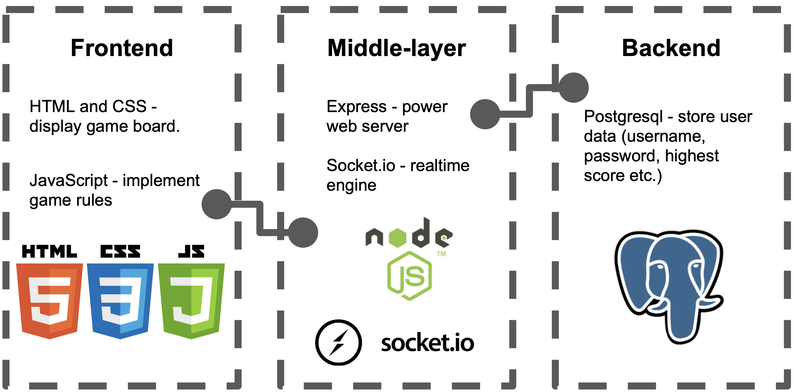

# Project Milestone 1 - Proposal
Team Number: **013-1** | Team Name: **Computer Mafia**
***

### Team Members
* Aiden Colley
* Benny Sakiewicz
* Junyu Chen
* Sam Harris
* Ziwei Cheng
* Zoe Roy
***

### Application Name
Demo IO
***

### Application Description
  The project will be a browser based .IO game. It will have multiplayer functionallity for friends to play together real time. PLayers will be able to decide their in game names and jump into a server with others. The value of this project is in how entertaining it is for players.
  
  As for the mechanics of the game, players will load into a 2D top down view of a map. The camera will be centered on their ingame character which will be a vehicle. The player will be able to manuver their vehicle to collect powerups and coins to increase in size or strength. They will be competing against each other for superiority and greatest strength, and their name on a leaderboard. The players highest scores will be tracked and posted on a seperate leaderboard for others to see.
***

### Vision Statement

This product is for casual gamers who need a source of competative social interaction. Demo IO is a videogame that is easy to access and provides entertaining gameplay. Unlike app games, our product requires no download and easy access for everyone.
***

### Version Control
[Link to GitHub repository](https://github.com/CSCI-3308-CU-Boulder/3308SP21_section013_1)
***

### Development Method
Agile/Scrum

Project Management: [Jira](https://csci-3308-spring21-013-1.atlassian.net/jira/software/projects/C01/boards/1)
***

### Communication Plan
* We have a GroupMe where we can all communicate together as a team and also communicate with each individual. 
***

### Meeting Plan
* Time: Monday and Tuesday 5pm to 6pm
* Mode: Group video chat (Zoom)
***

### Proposed Architecture Plan
**Frontend**

* Use HTML5 canvas (with CSS) as the game board on the webpage. 
* Use JavaScript to implement game rules etc.
  
**Middle layer**

* Use [Express](https://expressjs.com) (framework based on Node.js) to power the web server
* Use socket.io (websocket library) to accomplish real-time multiplayer connection.

**Backend**

* Use postgresql (may change) to store data (eg. player's highest score).

***

### Use Case Diagram

