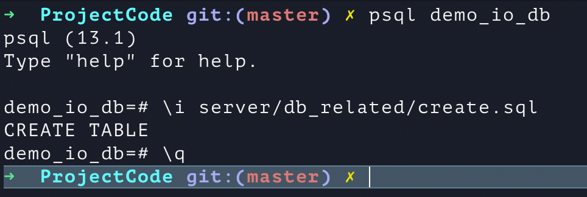

# Database (local) set up

0. Check if postgresql is install on the mechine. If not, can be install through homebrew (https://formulae.brew.sh/formula/postgresql).

1. Create database (if not exist). In terminal `createdb demo_io_db`.

2. Create the tables using the query in `server/db_related/create.sql` file.
    Step 1: in terminal `psql demo_io_db`
    Step 2: in terminal `\i server/db_related/create.sql` (teminal location is in PojectCode)

3. (Optional) There is also a `insert_example.sql` in `db_related` folder.

4. In terminal `\q` to quit.

# Run the game

0. Check if all the npm dependencies are installed: (only need to do this when new package is added)
    cd to server folder and in terminal `npm install`. (this command will check if all the package list in `package.json` is installed, and will install the missing one accordingly.)

1. Run the Server

    Option A. In terminal, cd to server folder, run `npm run dev`. (no need to restart every time server code is changed)

    Option B. In terminal, cd to server folder, run `npm start`or equivalently  `node server.js`. (need to restart everytime server code is changed.)

2. Go in to frontend folder, and open `index.html` file in the browser, the game should be running.

# Directory structure

see `docs/directory structure.md`